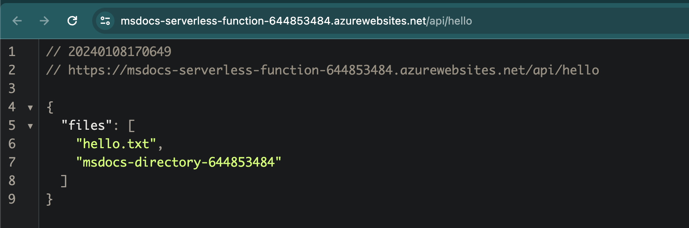
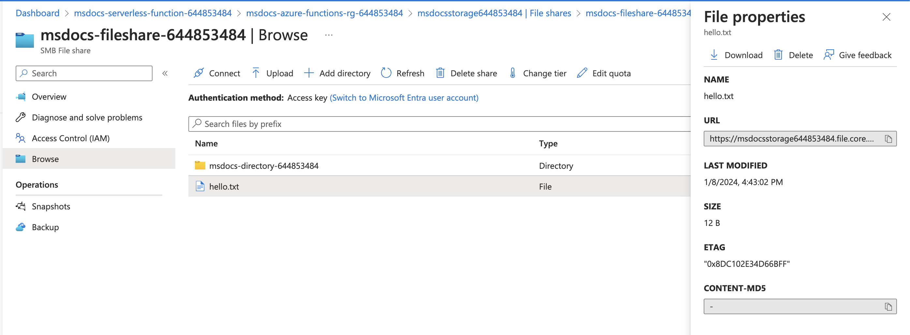

# Azure Functions with File Share Example

Note: Only support Linux Function App, Windows Container Function App

Doc: 
- https://learn.microsoft.com/en-us/azure/azure-functions/scripts/functions-cli-mount-files-storage-linux
- https://learn.microsoft.com/en-us/azure/azure-functions/storage-considerations?tabs=azure-cli#mount-file-shares-


When deploy the Azure Functions can access the fileshare via filesystem 



and you can see all files in the file share



## Local Dev

> Note: This code cannot run on local, please test on Azure.

2. copy `.env.sample` to `.env`
3. then run local

```
yarn dev
```

## Run Azure Functions Worker on Local

1. Prep Azure Functions Config on local, create `local.settings.json`

  ```json
  {
    "IsEncrypted": false,
    "Values": {
        "FUNCTIONS_WORKER_RUNTIME": "node",
        "AzureWebJobsFeatureFlags": "EnableWorkerIndexing",
        "AzureWebJobsStorage": "UseDevelopmentStorage=true"
        },
    "ConnectionStrings": {}
    }
  ```

2. Run with Azure Functions worker

  ```
  yarn start
  ```

## Deploy to Azure functions

1. Create Azure Functions on Azure via CLI
   ```bash
   export randomIdentifier=$RANDOM$RANDOM
   ./scripts/create-infra.sh $randomIdentifier
   ```

2. Deploy
   ```bash
   ./scripts/deploy.sh $randomIdentifier
   ```


## Destory 

```bash
az group delete --name msdocs-azure-functions-rg-$randomIdentifier
```